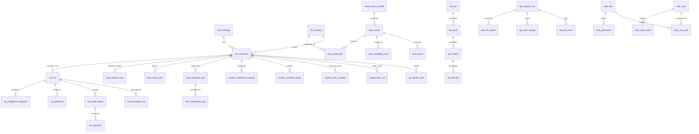

# AVIS Database ER Specification

Status: Draft  
Owner: Spec Architect

## Objective
Provide a standalone Entity-Relationship specification for AVIS PostgreSQL, covering entity ownership, cardinality, keys, and critical integrity constraints.

## Entity Domains
- `ref_*`: canonical dimensions (company, instrument, exchange)
- `market_*`: market prices, actions, and depth snapshots
- `fund_*`: financial statements, derived metrics, restatements, segment facts
- `news_*`: source profiles, article records, entity links, events, reliability
- `val_*`: valuation run lifecycle, assumptions, outputs, sensitivity, attribution, confidence
- `dq_*`: data quality rules, results, incidents, overrides
- `ops_*`: pipeline runs, job events, lineage, SLA breach records
- `auth_*`: users, roles, permissions, assignments, audit events

## Key Cardinalities
- `ref_company` 1:N `ref_instrument`
- `ref_exchange` 1:N `ref_instrument`
- `ref_instrument` 1:N `market_ohlcv_1d`
- `ref_instrument` 1:N `fund_statement_fact`
- `news_article` N:M `ref_company` via `news_entity_link`
- `val_run` 1:N `val_model_output`
- `val_model_output` 1:N `val_sensitivity`
- `dq_rule` 1:N `dq_result`
- `dq_result` 1:N `dq_incident` (logical escalation)
- `ops_pipeline_run` 1:N `ops_job_event`
- `auth_user` N:M `auth_role` via `auth_user_role`

## ER Diagram

## Integrity Constraints (Critical)
- Canonical instrument identity must resolve through `ref_instrument` before writing `market_*`, `fund_*`, or `val_*` facts.
- Point-in-time financial facts must preserve effective windows in `fund_statement_fact`.
- Valuation outputs must reference a completed `val_run`.
- DQ override entries require corresponding approver identity in `auth_user`.
- Article-to-company links must pass confidence/relevance thresholds before valuation use.

## Out of Scope
- Physical partition DDL
- Query optimization hints
- Storage engine and infrastructure sizing
