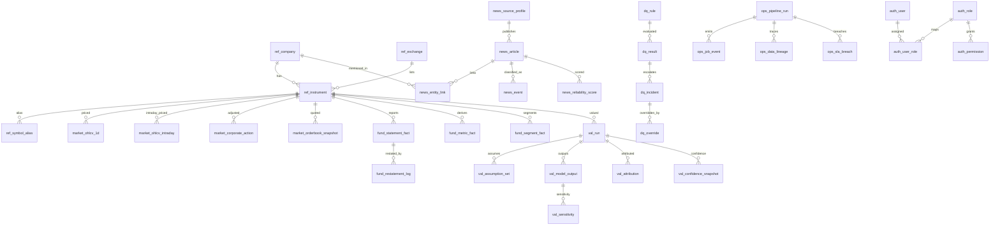

# AVIS PostgreSQL Detailed Specification

Status: Draft  
Owner: Spec Architect  
Scope: Logical data design for AVIS research intelligence platform

## 1) Database ER Specification

### 1.1 Objective
Define an auditable, point-in-time-correct, analytics-friendly PostgreSQL schema for AVIS across reference, market, fundamentals, news, valuation, data quality, operations, and authentication domains.

### 1.2 Core ER Design Principles
- Canonical entity identity is anchored on `ref_company` and `ref_instrument`.
- Time-series facts are modeled separately from slowly changing reference dimensions.
- Every critical fact table includes provenance (`source_system`, `source_record_id`, `ingested_at`).
- Write-heavy operational tables are separated from read-heavy research tables.
- Soft deletion is preferred for governance-critical entities.

### 1.3 Domain Relationships (High Level)
- `ref_company` 1:N `ref_instrument`
- `ref_instrument` 1:N `market_*` and `fund_*`
- `news_article` N:M `ref_company` via `news_entity_link`
- `val_run` N:1 `ref_instrument`, 1:N `val_model_output`
- `dq_rule` 1:N `dq_result`
- `ops_pipeline_run` 1:N `ops_job_event`
- `auth_user` N:M `auth_role` via `auth_user_role`

### 1.4 ER Diagram (Logical)

## 2) Naming and Type Standards
- Primary keys: `bigserial` for high-volume fact tables, `uuid` for externally exposed IDs.
- Temporal columns: `timestamptz` only.
- Money/ratios: `numeric(p,s)`; avoid floating types for valuation-critical values.
- Flexible payload: `jsonb` with explicit schema registry reference.
- Soft delete: `is_active boolean`, `deactivated_at timestamptz` where needed.

## 3) Table Specifications

---

## A) `ref_*` Tables

### A1. `ref_exchange`
Purpose: Master list of exchanges supported by AVIS.

Columns:
- `exchange_id` `smallserial` PK
- `exchange_code` `varchar(16)` NOT NULL UNIQUE
- `exchange_name` `varchar(128)` NOT NULL
- `country_code` `char(2)` NOT NULL
- `timezone` `varchar(64)` NOT NULL
- `currency_code` `char(3)` NOT NULL
- `is_active` `boolean` NOT NULL DEFAULT true
- `created_at` `timestamptz` NOT NULL
- `updated_at` `timestamptz` NOT NULL

Indexes:
- `ux_ref_exchange_code` unique (`exchange_code`)
- `ix_ref_exchange_active` (`is_active`)

Relationships:
- Referenced by `ref_instrument.exchange_id`

Constraints:
- `exchange_code` uppercase alphanumeric + `_` only

Retention Rules:
- Permanent dimension; deactivation instead of deletion

Example:
- `{exchange_code: "NSE", exchange_name: "National Stock Exchange of India"}`

### A2. `ref_company`
Purpose: Canonical legal entity for issuer-level analysis.

Columns:
- `company_id` `bigserial` PK
- `company_uuid` `uuid` NOT NULL UNIQUE
- `legal_name` `varchar(256)` NOT NULL
- `display_name` `varchar(256)` NOT NULL
- `isin_primary` `char(12)` NULL
- `sector_code` `varchar(32)` NULL
- `industry_code` `varchar(32)` NULL
- `incorporation_country` `char(2)` NULL
- `is_listed` `boolean` NOT NULL DEFAULT true
- `is_active` `boolean` NOT NULL DEFAULT true
- `created_at` `timestamptz` NOT NULL
- `updated_at` `timestamptz` NOT NULL

Indexes:
- `ux_ref_company_uuid` unique (`company_uuid`)
- `ix_ref_company_display_name` (`display_name`)
- `ix_ref_company_sector_industry` (`sector_code`, `industry_code`)

Relationships:
- Parent of `ref_instrument`, `news_entity_link`, `fund_*` (indirect via instrument)

Constraints:
- `isin_primary` must pass ISIN format check when present

Retention Rules:
- Permanent; historical names managed in aliases table if needed

Example:
- `{display_name: "ITC", isin_primary: "INE154A01025"}`

### A3. `ref_instrument`
Purpose: Tradable instrument registry (equity primary for AVIS).

Columns:
- `instrument_id` `bigserial` PK
- `instrument_uuid` `uuid` NOT NULL UNIQUE
- `company_id` `bigint` NOT NULL FK -> `ref_company.company_id`
- `exchange_id` `smallint` NOT NULL FK -> `ref_exchange.exchange_id`
- `symbol` `varchar(64)` NOT NULL
- `instrument_type` `varchar(32)` NOT NULL
- `listing_date` `date` NULL
- `delisting_date` `date` NULL
- `tick_size` `numeric(12,6)` NULL
- `lot_size` `integer` NULL
- `is_active` `boolean` NOT NULL DEFAULT true
- `created_at` `timestamptz` NOT NULL
- `updated_at` `timestamptz` NOT NULL

Indexes:
- `ux_ref_instrument_exchange_symbol_active` unique (`exchange_id`, `symbol`, `is_active`)
- `ix_ref_instrument_company` (`company_id`)

Relationships:
- Parent for `market_*`, `fund_*`, `val_*`

Constraints:
- `instrument_type` in (`EQUITY`, `ETF`, `ADR`, `PREF`)

Retention Rules:
- Permanent with lifecycle dates

Example:
- `{symbol: "ITC", instrument_type: "EQUITY", exchange_id: 1}`

### A4. `ref_symbol_alias`
Purpose: Track ticker changes and source-specific symbol aliases over time.

Columns:
- `alias_id` `bigserial` PK
- `instrument_id` `bigint` NOT NULL FK -> `ref_instrument.instrument_id`
- `source_system` `varchar(64)` NOT NULL
- `alias_symbol` `varchar(64)` NOT NULL
- `valid_from` `date` NOT NULL
- `valid_to` `date` NULL
- `created_at` `timestamptz` NOT NULL

Indexes:
- `ix_ref_symbol_alias_inst` (`instrument_id`)
- `ix_ref_symbol_alias_source_symbol` (`source_system`, `alias_symbol`)
- `ix_ref_symbol_alias_validity` (`valid_from`, `valid_to`)

Relationships:
- Child of `ref_instrument`

Constraints:
- No overlapping validity ranges for same (`instrument_id`, `source_system`)

Retention Rules:
- Permanent historical

Example:
- `{source_system: "BSE", alias_symbol: "500875", valid_from: "2000-01-01"}`

### A5. `ref_calendar`
Purpose: Trading and reporting calendar by exchange/date.

Columns:
- `calendar_id` `bigserial` PK
- `exchange_id` `smallint` NOT NULL FK -> `ref_exchange.exchange_id`
- `trade_date` `date` NOT NULL
- `is_trading_day` `boolean` NOT NULL
- `session_open_ts` `timestamptz` NULL
- `session_close_ts` `timestamptz` NULL
- `holiday_name` `varchar(128)` NULL
- `created_at` `timestamptz` NOT NULL

Indexes:
- `ux_ref_calendar_exchange_date` unique (`exchange_id`, `trade_date`)
- `ix_ref_calendar_trading_day` (`is_trading_day`)

Relationships:
- Referenced by validation logic in `market_*` pipelines

Constraints:
- If `is_trading_day = false`, open/close may be null

Retention Rules:
- Permanent

Example:
- `{exchange_id: 1, trade_date: "2026-01-26", is_trading_day: false, holiday_name: "Republic Day"}`

---

## B) `market_*` Tables

### B1. `market_ohlcv_1d`
Purpose: Daily OHLCV and adjusted pricing.

Columns:
- `ohlcv_1d_id` `bigserial` PK
- `instrument_id` `bigint` NOT NULL FK -> `ref_instrument.instrument_id`
- `trade_date` `date` NOT NULL
- `open_px` `numeric(18,6)` NOT NULL
- `high_px` `numeric(18,6)` NOT NULL
- `low_px` `numeric(18,6)` NOT NULL
- `close_px` `numeric(18,6)` NOT NULL
- `adj_close_px` `numeric(18,6)` NULL
- `volume` `numeric(24,0)` NOT NULL
- `turnover` `numeric(24,2)` NULL
- `source_system` `varchar(64)` NOT NULL
- `source_record_id` `varchar(128)` NULL
- `ingested_at` `timestamptz` NOT NULL

Indexes:
- `ux_market_ohlcv_1d_inst_date` unique (`instrument_id`, `trade_date`)
- `ix_market_ohlcv_1d_date` (`trade_date`)

Relationships:
- Child of `ref_instrument`

Constraints:
- `high_px >= greatest(open_px, close_px)`
- `low_px <= least(open_px, close_px)`

Retention Rules:
- Hot: 5 years in primary store; older may be archived but queryable

Example:
- `{instrument_id: 101, trade_date: "2026-05-29", open_px: 427.1, close_px: 431.8, volume: 12233445}`

### B2. `market_ohlcv_intraday`
Purpose: Intraday bar-level market data.

Columns:
- `ohlcv_intraday_id` `bigserial` PK
- `instrument_id` `bigint` NOT NULL FK
- `bar_start_ts` `timestamptz` NOT NULL
- `bar_end_ts` `timestamptz` NOT NULL
- `bar_interval_sec` `integer` NOT NULL
- `open_px` `numeric(18,6)` NOT NULL
- `high_px` `numeric(18,6)` NOT NULL
- `low_px` `numeric(18,6)` NOT NULL
- `close_px` `numeric(18,6)` NOT NULL
- `volume` `numeric(24,0)` NOT NULL
- `vwap` `numeric(18,6)` NULL
- `source_system` `varchar(64)` NOT NULL
- `ingested_at` `timestamptz` NOT NULL

Indexes:
- `ux_market_intraday_inst_start_interval` unique (`instrument_id`, `bar_start_ts`, `bar_interval_sec`)
- `ix_market_intraday_time` (`bar_start_ts`)

Relationships:
- Child of `ref_instrument`

Constraints:
- `bar_end_ts > bar_start_ts`

Retention Rules:
- Hot: 12 months; warm/archive thereafter based on SLA

Example:
- `{instrument_id: 101, bar_start_ts: "2026-06-01T03:45:00Z", bar_interval_sec: 60, close_px: 432.05}`

### B3. `market_corporate_action`
Purpose: Corporate action registry for split/dividend/bonus/right events.

Columns:
- `corp_action_id` `bigserial` PK
- `instrument_id` `bigint` NOT NULL FK
- `action_type` `varchar(32)` NOT NULL
- `announcement_date` `date` NULL
- `ex_date` `date` NOT NULL
- `record_date` `date` NULL
- `effective_date` `date` NULL
- `action_value` `numeric(20,8)` NULL
- `action_ratio_num` `numeric(20,8)` NULL
- `action_ratio_den` `numeric(20,8)` NULL
- `currency_code` `char(3)` NULL
- `source_system` `varchar(64)` NOT NULL
- `source_record_id` `varchar(128)` NULL
- `ingested_at` `timestamptz` NOT NULL

Indexes:
- `ix_market_corp_action_inst_exdate` (`instrument_id`, `ex_date`)
- `ix_market_corp_action_type` (`action_type`)

Relationships:
- Child of `ref_instrument`

Constraints:
- `action_type` in (`DIVIDEND`, `SPLIT`, `BONUS`, `RIGHTS`, `MERGER`, `DEMERGER`)

Retention Rules:
- Permanent

Example:
- `{instrument_id: 101, action_type: "DIVIDEND", ex_date: "2026-02-15", action_value: 6.5}`

### B4. `market_orderbook_snapshot`
Purpose: Snapshot market depth for selected intervals.

Columns:
- `snapshot_id` `bigserial` PK
- `instrument_id` `bigint` NOT NULL FK
- `snapshot_ts` `timestamptz` NOT NULL
- `depth_level` `smallint` NOT NULL
- `best_bid_px` `numeric(18,6)` NULL
- `best_bid_qty` `numeric(24,0)` NULL
- `best_ask_px` `numeric(18,6)` NULL
- `best_ask_qty` `numeric(24,0)` NULL
- `book_payload` `jsonb` NOT NULL
- `source_system` `varchar(64)` NOT NULL
- `ingested_at` `timestamptz` NOT NULL

Indexes:
- `ix_market_orderbook_inst_ts` (`instrument_id`, `snapshot_ts`)
- `gin_market_orderbook_payload` GIN (`book_payload`)

Relationships:
- Child of `ref_instrument`

Constraints:
- `depth_level >= 1`

Retention Rules:
- Hot: 90 days default; archive for regulated backtesting use cases

Example:
- `{instrument_id: 101, snapshot_ts: "2026-06-01T04:01:00Z", depth_level: 5}`

---

## C) `fund_*` Tables

### C1. `fund_statement_fact`
Purpose: Normalized line-item facts from financial statements (P&L/BS/CF).

Columns:
- `statement_fact_id` `bigserial` PK
- `instrument_id` `bigint` NOT NULL FK
- `fiscal_year` `smallint` NOT NULL
- `fiscal_period` `varchar(8)` NOT NULL
- `statement_type` `varchar(8)` NOT NULL
- `line_item_code` `varchar(64)` NOT NULL
- `value` `numeric(24,4)` NOT NULL
- `currency_code` `char(3)` NOT NULL
- `scale_code` `varchar(16)` NOT NULL
- `as_reported_ts` `timestamptz` NOT NULL
- `effective_from_ts` `timestamptz` NOT NULL
- `effective_to_ts` `timestamptz` NULL
- `source_system` `varchar(64)` NOT NULL
- `source_record_id` `varchar(128)` NULL
- `ingested_at` `timestamptz` NOT NULL

Indexes:
- `ix_fund_statement_inst_period` (`instrument_id`, `fiscal_year`, `fiscal_period`)
- `ix_fund_statement_line_item` (`line_item_code`)
- `ix_fund_statement_effective_window` (`effective_from_ts`, `effective_to_ts`)

Relationships:
- Child of `ref_instrument`
- Parent of `fund_restatement_log` via `statement_fact_id`

Constraints:
- `statement_type` in (`PL`, `BS`, `CF`)
- `fiscal_period` in (`Q1`, `Q2`, `Q3`, `Q4`, `FY`, `H1`, `H2`, `TTM`)

Retention Rules:
- Permanent point-in-time history

Example:
- `{instrument_id: 101, fiscal_year: 2025, fiscal_period: "FY", line_item_code: "Revenue", value: 7354000}`

### C2. `fund_metric_fact`
Purpose: Derived financial metrics and ratios.

Columns:
- `metric_fact_id` `bigserial` PK
- `instrument_id` `bigint` NOT NULL FK
- `metric_code` `varchar(64)` NOT NULL
- `metric_value` `numeric(24,8)` NOT NULL
- `metric_unit` `varchar(32)` NOT NULL
- `as_of_date` `date` NOT NULL
- `lookback_period` `varchar(16)` NULL
- `calc_version` `varchar(32)` NOT NULL
- `input_hash` `varchar(128)` NOT NULL
- `created_at` `timestamptz` NOT NULL

Indexes:
- `ux_fund_metric_inst_metric_asof_version` unique (`instrument_id`, `metric_code`, `as_of_date`, `calc_version`)
- `ix_fund_metric_metric_code` (`metric_code`)

Relationships:
- Child of `ref_instrument`

Constraints:
- `metric_value` finite and not NaN

Retention Rules:
- Permanent with version history

Example:
- `{metric_code: "ROCE", metric_value: 0.2845, metric_unit: "ratio", as_of_date: "2026-03-31"}`

### C3. `fund_restatement_log`
Purpose: Capture restatement/revision events for statement facts.

Columns:
- `restatement_id` `bigserial` PK
- `statement_fact_id` `bigint` NOT NULL FK -> `fund_statement_fact.statement_fact_id`
- `restatement_type` `varchar(32)` NOT NULL
- `old_value` `numeric(24,4)` NOT NULL
- `new_value` `numeric(24,4)` NOT NULL
- `reason_text` `text` NULL
- `detected_at` `timestamptz` NOT NULL
- `source_system` `varchar(64)` NOT NULL

Indexes:
- `ix_fund_restatement_fact` (`statement_fact_id`)
- `ix_fund_restatement_detected` (`detected_at`)

Relationships:
- Child of `fund_statement_fact`

Constraints:
- `new_value <> old_value`

Retention Rules:
- Permanent audit trail

Example:
- `{statement_fact_id: 90011, old_value: 12000, new_value: 11840, restatement_type: "REGULATORY_FILING_REVISION"}`

### C4. `fund_segment_fact`
Purpose: Segment-level revenue/profit/capital facts for SOTP workflows.

Columns:
- `segment_fact_id` `bigserial` PK
- `instrument_id` `bigint` NOT NULL FK
- `segment_code` `varchar(64)` NOT NULL
- `segment_name` `varchar(128)` NOT NULL
- `metric_code` `varchar(64)` NOT NULL
- `metric_value` `numeric(24,4)` NOT NULL
- `fiscal_year` `smallint` NOT NULL
- `fiscal_period` `varchar(8)` NOT NULL
- `currency_code` `char(3)` NOT NULL
- `as_reported_ts` `timestamptz` NOT NULL
- `source_system` `varchar(64)` NOT NULL
- `ingested_at` `timestamptz` NOT NULL

Indexes:
- `ix_fund_segment_inst_segment_period` (`instrument_id`, `segment_code`, `fiscal_year`, `fiscal_period`)
- `ix_fund_segment_metric` (`metric_code`)

Relationships:
- Child of `ref_instrument`

Constraints:
- `metric_code` in approved segment metric taxonomy

Retention Rules:
- Permanent

Example:
- `{segment_code: "FMCG", metric_code: "Revenue", metric_value: 1825000, fiscal_year: 2025}`

---

## D) `news_*` Tables

### D1. `news_source_profile`
Purpose: Source registry with reliability and legal usage metadata.

Columns:
- `source_id` `bigserial` PK
- `source_code` `varchar(64)` NOT NULL UNIQUE
- `source_name` `varchar(128)` NOT NULL
- `source_type` `varchar(32)` NOT NULL
- `license_class` `varchar(32)` NOT NULL
- `base_reliability_score` `numeric(5,2)` NOT NULL
- `terms_url` `text` NULL
- `is_active` `boolean` NOT NULL DEFAULT true
- `created_at` `timestamptz` NOT NULL

Indexes:
- `ux_news_source_code` unique (`source_code`)
- `ix_news_source_active` (`is_active`)

Relationships:
- Parent of `news_article`

Constraints:
- `base_reliability_score` between 0 and 100

Retention Rules:
- Permanent; status updates tracked

Example:
- `{source_code: "EXCH_DISCLOSURE", source_type: "REGULATORY", base_reliability_score: 95}`

### D2. `news_article`
Purpose: Canonical article/document record.

Columns:
- `article_id` `bigserial` PK
- `source_id` `bigint` NOT NULL FK -> `news_source_profile.source_id`
- `external_article_id` `varchar(256)` NULL
- `url` `text` NOT NULL
- `headline` `text` NOT NULL
- `published_at` `timestamptz` NOT NULL
- `captured_at` `timestamptz` NOT NULL
- `language_code` `varchar(8)` NULL
- `article_text_hash` `varchar(128)` NOT NULL
- `article_text` `text` NULL
- `raw_payload` `jsonb` NULL
- `is_paywalled` `boolean` NOT NULL DEFAULT false

Indexes:
- `ux_news_article_source_external` unique (`source_id`, `external_article_id`)
- `ix_news_article_published_at` (`published_at`)
- `ix_news_article_hash` (`article_text_hash`)

Relationships:
- Child of `news_source_profile`
- Parent of `news_entity_link`, `news_event`, `news_reliability_score`

Constraints:
- `captured_at >= published_at`

Retention Rules:
- Metadata permanent; full text per licensing policy

Example:
- `{headline: "Company X announces demerger", published_at: "2026-04-22T08:10:00Z"}`

### D3. `news_entity_link`
Purpose: Link articles to entities with relevance weights.

Columns:
- `entity_link_id` `bigserial` PK
- `article_id` `bigint` NOT NULL FK -> `news_article.article_id`
- `company_id` `bigint` NOT NULL FK -> `ref_company.company_id`
- `mention_type` `varchar(32)` NOT NULL
- `relevance_score` `numeric(5,2)` NOT NULL
- `sentiment_score` `numeric(6,3)` NULL
- `created_at` `timestamptz` NOT NULL

Indexes:
- `ux_news_entity_unique` unique (`article_id`, `company_id`, `mention_type`)
- `ix_news_entity_company` (`company_id`)

Relationships:
- Child of `news_article` and `ref_company`

Constraints:
- `relevance_score` between 0 and 100

Retention Rules:
- Permanent

Example:
- `{article_id: 8801, company_id: 120, mention_type: "PRIMARY", relevance_score: 92.5}`

### D4. `news_event`
Purpose: Extracted valuation-relevant event classification from news.

Columns:
- `event_id` `bigserial` PK
- `article_id` `bigint` NOT NULL FK -> `news_article.article_id`
- `event_type` `varchar(64)` NOT NULL
- `event_subtype` `varchar(64)` NULL
- `event_direction` `varchar(16)` NULL
- `event_severity` `numeric(5,2)` NULL
- `event_payload` `jsonb` NULL
- `event_confidence` `numeric(5,2)` NOT NULL
- `created_at` `timestamptz` NOT NULL

Indexes:
- `ix_news_event_type` (`event_type`)
- `ix_news_event_article` (`article_id`)
- `gin_news_event_payload` GIN (`event_payload`)

Relationships:
- Child of `news_article`

Constraints:
- `event_confidence` between 0 and 100
- `event_direction` in (`POSITIVE`, `NEGATIVE`, `NEUTRAL`) when present

Retention Rules:
- Permanent

Example:
- `{event_type: "REGULATORY_CHANGE", event_direction: "NEGATIVE", event_confidence: 87.2}`

### D5. `news_reliability_score`
Purpose: Per-article reliability assessment used by confidence and valuation engines.

Columns:
- `reliability_id` `bigserial` PK
- `article_id` `bigint` NOT NULL FK -> `news_article.article_id`
- `source_reliability` `numeric(5,2)` NOT NULL
- `content_consistency` `numeric(5,2)` NOT NULL
- `cross_source_confirmation` `numeric(5,2)` NOT NULL
- `final_reliability_score` `numeric(5,2)` NOT NULL
- `scoring_version` `varchar(32)` NOT NULL
- `scored_at` `timestamptz` NOT NULL

Indexes:
- `ux_news_rel_article_version` unique (`article_id`, `scoring_version`)
- `ix_news_rel_final_score` (`final_reliability_score`)

Relationships:
- Child of `news_article`

Constraints:
- all score columns between 0 and 100

Retention Rules:
- Permanent with versioning

Example:
- `{article_id: 8801, final_reliability_score: 81.0, scoring_version: "v2"}`

---

## E) `val_*` Tables

### E1. `val_run`
Purpose: Valuation run header for one instrument and as-of timestamp.

Columns:
- `val_run_id` `bigserial` PK
- `run_uuid` `uuid` NOT NULL UNIQUE
- `instrument_id` `bigint` NOT NULL FK -> `ref_instrument.instrument_id`
- `as_of_ts` `timestamptz` NOT NULL
- `run_type` `varchar(32)` NOT NULL
- `trigger_type` `varchar(32)` NOT NULL
- `status` `varchar(16)` NOT NULL
- `pipeline_run_id` `bigint` NULL FK -> `ops_pipeline_run.pipeline_run_id`
- `created_at` `timestamptz` NOT NULL
- `completed_at` `timestamptz` NULL

Indexes:
- `ix_val_run_inst_asof` (`instrument_id`, `as_of_ts`)
- `ix_val_run_status` (`status`)

Relationships:
- Parent of `val_assumption_set`, `val_model_output`, `val_attribution`, `val_confidence_snapshot`

Constraints:
- `status` in (`QUEUED`, `RUNNING`, `SUCCESS`, `FAILED`, `OVERRIDDEN`)

Retention Rules:
- Permanent

Example:
- `{instrument_id: 101, run_type: "SCHEDULED", status: "SUCCESS", as_of_ts: "2026-06-01T11:30:00Z"}`

### E2. `val_assumption_set`
Purpose: Versioned assumptions used by a specific valuation run.

Columns:
- `assumption_set_id` `bigserial` PK
- `val_run_id` `bigint` NOT NULL FK -> `val_run.val_run_id`
- `assumption_key` `varchar(128)` NOT NULL
- `assumption_value_numeric` `numeric(24,8)` NULL
- `assumption_value_text` `text` NULL
- `assumption_unit` `varchar(32)` NULL
- `source_type` `varchar(32)` NOT NULL
- `source_reference` `varchar(256)` NULL
- `created_at` `timestamptz` NOT NULL

Indexes:
- `ux_val_assumption_unique` unique (`val_run_id`, `assumption_key`)
- `ix_val_assumption_source_type` (`source_type`)

Relationships:
- Child of `val_run`

Constraints:
- at least one of numeric/text values must be non-null

Retention Rules:
- Permanent

Example:
- `{val_run_id: 7001, assumption_key: "WACC", assumption_value_numeric: 0.108}`

### E3. `val_model_output`
Purpose: Method-level valuation outputs per run.

Columns:
- `model_output_id` `bigserial` PK
- `val_run_id` `bigint` NOT NULL FK -> `val_run.val_run_id`
- `model_name` `varchar(64)` NOT NULL
- `model_version` `varchar(32)` NOT NULL
- `equity_value` `numeric(24,4)` NULL
- `enterprise_value` `numeric(24,4)` NULL
- `target_price` `numeric(18,6)` NULL
- `weight` `numeric(8,6)` NULL
- `currency_code` `char(3)` NOT NULL
- `output_payload` `jsonb` NULL
- `created_at` `timestamptz` NOT NULL

Indexes:
- `ux_val_model_run_name_version` unique (`val_run_id`, `model_name`, `model_version`)
- `ix_val_model_name` (`model_name`)

Relationships:
- Child of `val_run`
- Parent of `val_sensitivity`

Constraints:
- `model_name` in (`DCF`, `RELATIVE`, `SOTP`, `BLENDED`, `SCENARIO_WEIGHTED`)

Retention Rules:
- Permanent

Example:
- `{val_run_id: 7001, model_name: "DCF", target_price: 472.35, weight: 0.4}`

### E4. `val_sensitivity`
Purpose: Sensitivity outputs for key valuation assumptions.

Columns:
- `sensitivity_id` `bigserial` PK
- `model_output_id` `bigint` NOT NULL FK -> `val_model_output.model_output_id`
- `assumption_key` `varchar(128)` NOT NULL
- `shock_label` `varchar(64)` NOT NULL
- `shock_value` `numeric(24,8)` NOT NULL
- `result_target_price` `numeric(18,6)` NOT NULL
- `created_at` `timestamptz` NOT NULL

Indexes:
- `ix_val_sens_model_output` (`model_output_id`)
- `ix_val_sens_assumption_key` (`assumption_key`)

Relationships:
- Child of `val_model_output`

Constraints:
- `shock_label` must be unique per (`model_output_id`, `assumption_key`)

Retention Rules:
- Permanent

Example:
- `{assumption_key: "WACC", shock_label: "+50bps", result_target_price: 451.20}`

### E5. `val_attribution`
Purpose: Explainability breakdown for valuation movement by driver.

Columns:
- `attribution_id` `bigserial` PK
- `val_run_id` `bigint` NOT NULL FK -> `val_run.val_run_id`
- `driver_type` `varchar(64)` NOT NULL
- `driver_key` `varchar(128)` NOT NULL
- `impact_value_abs` `numeric(18,6)` NOT NULL
- `impact_value_pct` `numeric(9,4)` NULL
- `direction` `varchar(16)` NOT NULL
- `evidence_ref` `jsonb` NULL
- `created_at` `timestamptz` NOT NULL

Indexes:
- `ix_val_attr_run` (`val_run_id`)
- `ix_val_attr_driver` (`driver_type`, `driver_key`)

Relationships:
- Child of `val_run`

Constraints:
- `direction` in (`UP`, `DOWN`, `NEUTRAL`)

Retention Rules:
- Permanent

Example:
- `{driver_type: "NEWS_EVENT", driver_key: "MARGIN_EXPANSION", impact_value_abs: 12.5, direction: "UP"}`

### E6. `val_confidence_snapshot`
Purpose: Run-level confidence decomposition for valuation trust score.

Columns:
- `confidence_id` `bigserial` PK
- `val_run_id` `bigint` NOT NULL FK -> `val_run.val_run_id`
- `overall_confidence` `numeric(5,2)` NOT NULL
- `data_quality_score` `numeric(5,2)` NOT NULL
- `management_credibility_score` `numeric(5,2)` NOT NULL
- `industry_stability_score` `numeric(5,2)` NOT NULL
- `forecast_accuracy_score` `numeric(5,2)` NOT NULL
- `news_reliability_score` `numeric(5,2)` NOT NULL
- `model_agreement_score` `numeric(5,2)` NOT NULL
- `scenario_dispersion_score` `numeric(5,2)` NOT NULL
- `scoring_version` `varchar(32)` NOT NULL
- `created_at` `timestamptz` NOT NULL

Indexes:
- `ux_val_conf_run_version` unique (`val_run_id`, `scoring_version`)
- `ix_val_conf_overall` (`overall_confidence`)

Relationships:
- Child of `val_run`

Constraints:
- all score columns between 0 and 100

Retention Rules:
- Permanent

Example:
- `{val_run_id: 7001, overall_confidence: 73.4, model_agreement_score: 66.2}`

---

## F) `dq_*` Tables

### F1. `dq_rule`
Purpose: Master rule catalog for data quality checks.

Columns:
- `dq_rule_id` `bigserial` PK
- `rule_code` `varchar(64)` NOT NULL UNIQUE
- `rule_name` `varchar(256)` NOT NULL
- `domain_name` `varchar(32)` NOT NULL
- `severity` `varchar(16)` NOT NULL
- `rule_expression` `text` NOT NULL
- `is_active` `boolean` NOT NULL DEFAULT true
- `owner_team` `varchar(64)` NOT NULL
- `created_at` `timestamptz` NOT NULL
- `updated_at` `timestamptz` NOT NULL

Indexes:
- `ux_dq_rule_code` unique (`rule_code`)
- `ix_dq_rule_domain_severity` (`domain_name`, `severity`)

Relationships:
- Parent of `dq_result`

Constraints:
- `severity` in (`INFO`, `LOW`, `MEDIUM`, `HIGH`, `CRITICAL`)

Retention Rules:
- Permanent; deactivation for obsolete rules

Example:
- `{rule_code: "OHLCV_HIGH_LOW_VALID", severity: "HIGH"}`

### F2. `dq_result`
Purpose: Execution results of DQ rules on target datasets.

Columns:
- `dq_result_id` `bigserial` PK
- `dq_rule_id` `bigint` NOT NULL FK -> `dq_rule.dq_rule_id`
- `pipeline_run_id` `bigint` NULL FK -> `ops_pipeline_run.pipeline_run_id`
- `target_table` `varchar(128)` NOT NULL
- `target_record_key` `varchar(256)` NULL
- `status` `varchar(16)` NOT NULL
- `failure_reason` `text` NULL
- `measured_value` `varchar(256)` NULL
- `threshold_value` `varchar(256)` NULL
- `evaluated_at` `timestamptz` NOT NULL

Indexes:
- `ix_dq_result_rule_time` (`dq_rule_id`, `evaluated_at`)
- `ix_dq_result_status` (`status`)

Relationships:
- Child of `dq_rule`; parent of `dq_incident`

Constraints:
- `status` in (`PASS`, `FAIL`, `WARN`, `SKIPPED`)

Retention Rules:
- 3 years hot, then archive

Example:
- `{dq_rule_id: 88, target_table: "market_ohlcv_1d", status: "FAIL"}`

### F3. `dq_incident`
Purpose: Escalated quality incidents requiring triage and resolution.

Columns:
- `dq_incident_id` `bigserial` PK
- `dq_result_id` `bigint` NOT NULL FK -> `dq_result.dq_result_id`
- `incident_status` `varchar(16)` NOT NULL
- `impact_level` `varchar(16)` NOT NULL
- `assigned_to` `varchar(128)` NULL
- `opened_at` `timestamptz` NOT NULL
- `resolved_at` `timestamptz` NULL
- `resolution_notes` `text` NULL

Indexes:
- `ix_dq_incident_status` (`incident_status`)
- `ix_dq_incident_opened` (`opened_at`)

Relationships:
- Child of `dq_result`; parent of `dq_override`

Constraints:
- `incident_status` in (`OPEN`, `IN_PROGRESS`, `RESOLVED`, `CLOSED`)

Retention Rules:
- Permanent audit

Example:
- `{dq_result_id: 90551, incident_status: "OPEN", impact_level: "HIGH"}`

### F4. `dq_override`
Purpose: Authorized override record for DQ failures with justification.

Columns:
- `dq_override_id` `bigserial` PK
- `dq_incident_id` `bigint` NOT NULL FK -> `dq_incident.dq_incident_id`
- `approved_by_user_id` `bigint` NOT NULL FK -> `auth_user.user_id`
- `override_reason` `text` NOT NULL
- `override_expiry_ts` `timestamptz` NULL
- `created_at` `timestamptz` NOT NULL

Indexes:
- `ix_dq_override_incident` (`dq_incident_id`)
- `ix_dq_override_expiry` (`override_expiry_ts`)

Relationships:
- Child of `dq_incident` and `auth_user`

Constraints:
- `override_reason` min length policy applied

Retention Rules:
- Permanent

Example:
- `{dq_incident_id: 3001, approved_by_user_id: 45, override_reason: "Source correction expected EOD"}`

---

## G) `ops_*` Tables

### G1. `ops_pipeline_run`
Purpose: Pipeline run master table for orchestrated workflows.

Columns:
- `pipeline_run_id` `bigserial` PK
- `run_uuid` `uuid` NOT NULL UNIQUE
- `pipeline_name` `varchar(128)` NOT NULL
- `run_mode` `varchar(16)` NOT NULL
- `triggered_by` `varchar(64)` NOT NULL
- `status` `varchar(16)` NOT NULL
- `started_at` `timestamptz` NOT NULL
- `ended_at` `timestamptz` NULL
- `run_context` `jsonb` NULL

Indexes:
- `ix_ops_pipeline_name_started` (`pipeline_name`, `started_at`)
- `ix_ops_pipeline_status` (`status`)

Relationships:
- Parent for `ops_job_event`, `ops_data_lineage`, `ops_sla_breach`, referenced by `dq_result` and `val_run`

Constraints:
- `status` in (`QUEUED`, `RUNNING`, `SUCCESS`, `FAILED`, `CANCELLED`)

Retention Rules:
- 2 years hot, archive afterwards

Example:
- `{pipeline_name: "daily_market_ingest", run_mode: "SCHEDULED", status: "SUCCESS"}`

### G2. `ops_job_event`
Purpose: Fine-grained event log per pipeline step.

Columns:
- `job_event_id` `bigserial` PK
- `pipeline_run_id` `bigint` NOT NULL FK -> `ops_pipeline_run.pipeline_run_id`
- `job_name` `varchar(128)` NOT NULL
- `event_type` `varchar(32)` NOT NULL
- `event_ts` `timestamptz` NOT NULL
- `message` `text` NULL
- `metrics_payload` `jsonb` NULL

Indexes:
- `ix_ops_job_event_run` (`pipeline_run_id`)
- `ix_ops_job_event_type_ts` (`event_type`, `event_ts`)

Relationships:
- Child of `ops_pipeline_run`

Constraints:
- `event_type` in (`START`, `END`, `WARN`, `ERROR`, `RETRY`)

Retention Rules:
- 1 year hot; archive/compress

Example:
- `{job_name: "normalize_fundamentals", event_type: "RETRY", message: "Transient source timeout"}`

### G3. `ops_data_lineage`
Purpose: Data lineage mapping between source and target assets for each run.

Columns:
- `lineage_id` `bigserial` PK
- `pipeline_run_id` `bigint` NOT NULL FK
- `source_asset` `varchar(256)` NOT NULL
- `target_asset` `varchar(256)` NOT NULL
- `transform_id` `varchar(128)` NOT NULL
- `record_count_in` `bigint` NULL
- `record_count_out` `bigint` NULL
- `lineage_ts` `timestamptz` NOT NULL

Indexes:
- `ix_ops_lineage_run` (`pipeline_run_id`)
- `ix_ops_lineage_assets` (`source_asset`, `target_asset`)

Relationships:
- Child of `ops_pipeline_run`

Constraints:
- `record_count_in >= 0` and `record_count_out >= 0` when present

Retention Rules:
- Permanent for governed datasets

Example:
- `{source_asset: "raw.nse.ohlcv", target_asset: "market_ohlcv_1d", record_count_in: 2200}`

### G4. `ops_sla_breach`
Purpose: SLA breach incidents for freshness/latency/availability.

Columns:
- `sla_breach_id` `bigserial` PK
- `pipeline_run_id` `bigint` NULL FK
- `sla_type` `varchar(32)` NOT NULL
- `service_name` `varchar(128)` NOT NULL
- `expected_value` `numeric(18,4)` NULL
- `actual_value` `numeric(18,4)` NULL
- `breach_detected_at` `timestamptz` NOT NULL
- `resolved_at` `timestamptz` NULL
- `status` `varchar(16)` NOT NULL

Indexes:
- `ix_ops_sla_service_type` (`service_name`, `sla_type`)
- `ix_ops_sla_status` (`status`)

Relationships:
- Optional child of `ops_pipeline_run`

Constraints:
- `status` in (`OPEN`, `ACKNOWLEDGED`, `RESOLVED`)

Retention Rules:
- 5 years for audit

Example:
- `{service_name: "valuation_api", sla_type: "P95_LATENCY_MS", expected_value: 800, actual_value: 1420}`

---

## H) `auth_*` Tables

### H1. `auth_user`
Purpose: User identity registry for platform access and approvals.

Columns:
- `user_id` `bigserial` PK
- `user_uuid` `uuid` NOT NULL UNIQUE
- `email` `varchar(320)` NOT NULL UNIQUE
- `full_name` `varchar(256)` NOT NULL
- `status` `varchar(16)` NOT NULL
- `is_mfa_enabled` `boolean` NOT NULL DEFAULT false
- `last_login_at` `timestamptz` NULL
- `created_at` `timestamptz` NOT NULL
- `updated_at` `timestamptz` NOT NULL

Indexes:
- `ux_auth_user_email` unique (`email`)
- `ix_auth_user_status` (`status`)

Relationships:
- Parent of `auth_user_role`, referenced by `dq_override`

Constraints:
- `status` in (`ACTIVE`, `INACTIVE`, `LOCKED`)

Retention Rules:
- User record retained permanently for audit, even after deactivation

Example:
- `{email: "analyst@firm.com", status: "ACTIVE", is_mfa_enabled: true}`

### H2. `auth_role`
Purpose: Role catalog for RBAC.

Columns:
- `role_id` `bigserial` PK
- `role_code` `varchar(64)` NOT NULL UNIQUE
- `role_name` `varchar(128)` NOT NULL
- `description` `text` NULL
- `is_system_role` `boolean` NOT NULL DEFAULT false
- `created_at` `timestamptz` NOT NULL

Indexes:
- `ux_auth_role_code` unique (`role_code`)

Relationships:
- Parent of `auth_user_role`, `auth_permission`

Constraints:
- immutable `role_code` once used in grants

Retention Rules:
- Permanent with deprecation flag policy

Example:
- `{role_code: "VALUATION_APPROVER", role_name: "Valuation Approver"}`

### H3. `auth_permission`
Purpose: Fine-grained permissions assignable to roles.

Columns:
- `permission_id` `bigserial` PK
- `role_id` `bigint` NOT NULL FK -> `auth_role.role_id`
- `resource_code` `varchar(128)` NOT NULL
- `action_code` `varchar(64)` NOT NULL
- `effect` `varchar(8)` NOT NULL
- `created_at` `timestamptz` NOT NULL

Indexes:
- `ux_auth_permission_role_resource_action` unique (`role_id`, `resource_code`, `action_code`)
- `ix_auth_permission_resource` (`resource_code`)

Relationships:
- Child of `auth_role`

Constraints:
- `effect` in (`ALLOW`, `DENY`)

Retention Rules:
- Permanent with audit

Example:
- `{role_id: 4, resource_code: "VAL_RUN", action_code: "APPROVE", effect: "ALLOW"}`

### H4. `auth_user_role`
Purpose: Role assignments for users.

Columns:
- `user_role_id` `bigserial` PK
- `user_id` `bigint` NOT NULL FK -> `auth_user.user_id`
- `role_id` `bigint` NOT NULL FK -> `auth_role.role_id`
- `granted_by_user_id` `bigint` NULL FK -> `auth_user.user_id`
- `valid_from` `timestamptz` NOT NULL
- `valid_to` `timestamptz` NULL
- `created_at` `timestamptz` NOT NULL

Indexes:
- `ux_auth_user_role_unique_window` unique (`user_id`, `role_id`, `valid_from`)
- `ix_auth_user_role_user` (`user_id`)

Relationships:
- Bridge table `auth_user` <-> `auth_role`

Constraints:
- `valid_to` null or greater than `valid_from`

Retention Rules:
- Permanent role grant history

Example:
- `{user_id: 45, role_id: 4, valid_from: "2026-01-01T00:00:00Z"}`

### H5. `auth_audit_event`
Purpose: Security and governance audit events.

Columns:
- `audit_event_id` `bigserial` PK
- `user_id` `bigint` NULL FK -> `auth_user.user_id`
- `event_type` `varchar(64)` NOT NULL
- `resource_code` `varchar(128)` NULL
- `resource_id` `varchar(128)` NULL
- `event_ts` `timestamptz` NOT NULL
- `ip_address` `inet` NULL
- `user_agent` `text` NULL
- `event_payload` `jsonb` NULL

Indexes:
- `ix_auth_audit_user_ts` (`user_id`, `event_ts`)
- `ix_auth_audit_event_type` (`event_type`)
- `gin_auth_audit_payload` GIN (`event_payload`)

Relationships:
- Optional child of `auth_user`

Constraints:
- `event_type` in approved audit taxonomy

Retention Rules:
- Minimum 7 years

Example:
- `{user_id: 45, event_type: "DQ_OVERRIDE_APPROVED", resource_code: "DQ_INCIDENT", resource_id: "3001"}`

---

## 4) Cross-Table Constraint Rules
- No `val_run` with `status=SUCCESS` unless at least one `val_model_output` exists.
- No `val_model_output` for inactive instrument unless explicit override event exists.
- `news_event` consumption by valuation requires `news_reliability_score.final_reliability_score` above configured threshold.
- `dq_override` requires active approver role with matching permission.

## 5) Retention Policy Summary
- Reference dimensions: permanent
- Market intraday depth: short hot retention + archive
- Daily market and fundamentals: long retention with PIT history
- News text: licensing-dependent, metadata permanent
- Valuation and confidence: permanent
- DQ and ops: tiered retention, incidents/audits long-term
- Auth audit: minimum 7 years

## 6) Open Specification Questions
- Exact partition strategy thresholds by table volume class.
- Final SLA cutoffs for intraday freshness by market segment.
- Final legal retention policy for full article text by source license class.
- Region-specific compliance deltas for multi-jurisdiction deployment.
